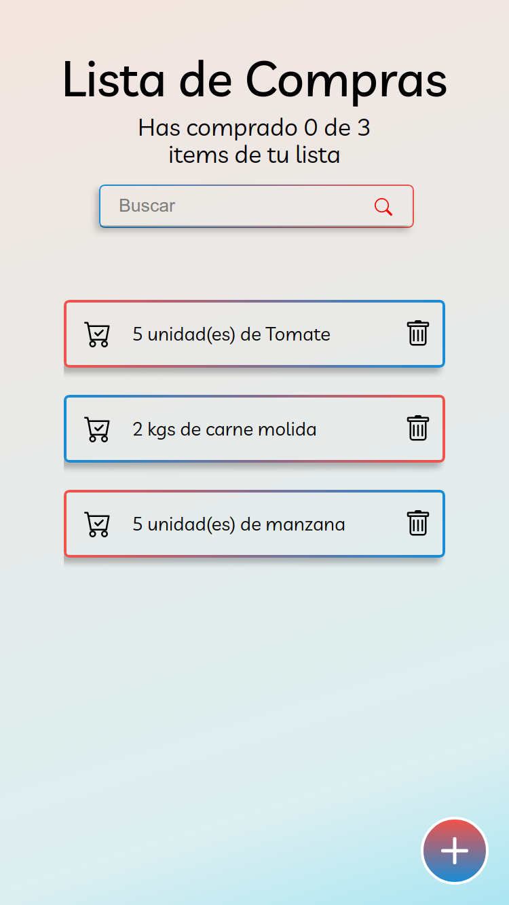

# Lista de Compras con ReactJS

## Descripción del Proyecto

Esta es una aplicación web que te permite guardar una lista de compras indicando la cantidad, medida y elemento que deseas comprar. Esta aplicación te permite agregar y eliminar elementos de tu lista. También tachar o destachar de acuerdo a como los vayas comprando.

Para ver la página web haz [click aqui](https://rodruxdev.github.io/buying-list/)

## Características

- Añadir elementos a la lista de compras con cantidad y unidad de medida.
- Tachar elementos ya comprados de la lista.
- Eliminar elementos de la lista.
- Guardar elementos de la lista en Local Storage

## Instalación del Proyecto en Local

1. Clona o descarga el repositorio en tu equipo.
2. Ingresa al directiorio del repositorio por terminal.
3. Instala las dependencias del proyecto utilizando NodeJS con el comando `npm install`.
4. Inicia un servidor local del proyecto con el comando `npm run start`.
5. Ingresa en tu navegador a la dirección indicada.

## Tecnologías

Las tecnologías utilizadas en el proyecto:

- React.js
- JavaScript
- CSS3 y HTML5

## Recursos

Este proyecto es una adaptación de los proyectos de los cursos de ReactJS con [Platzi](https://platzi.com/cursos/react/).

## Licencia

> Este proyecto esta bajo la licencia MIT
> 

## **Autor**

Hecho con 💚 por [rodruxdev](https://twitter.com/rodruxdev)